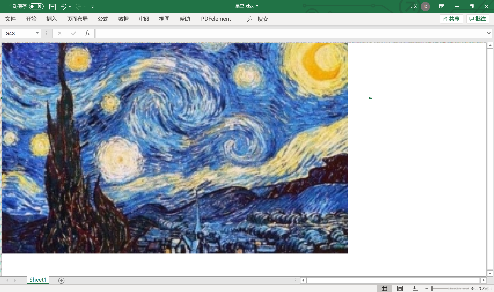
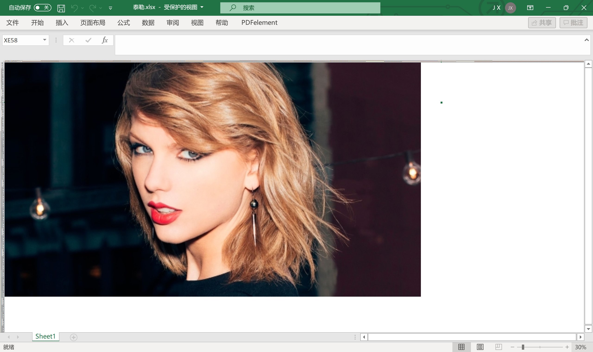
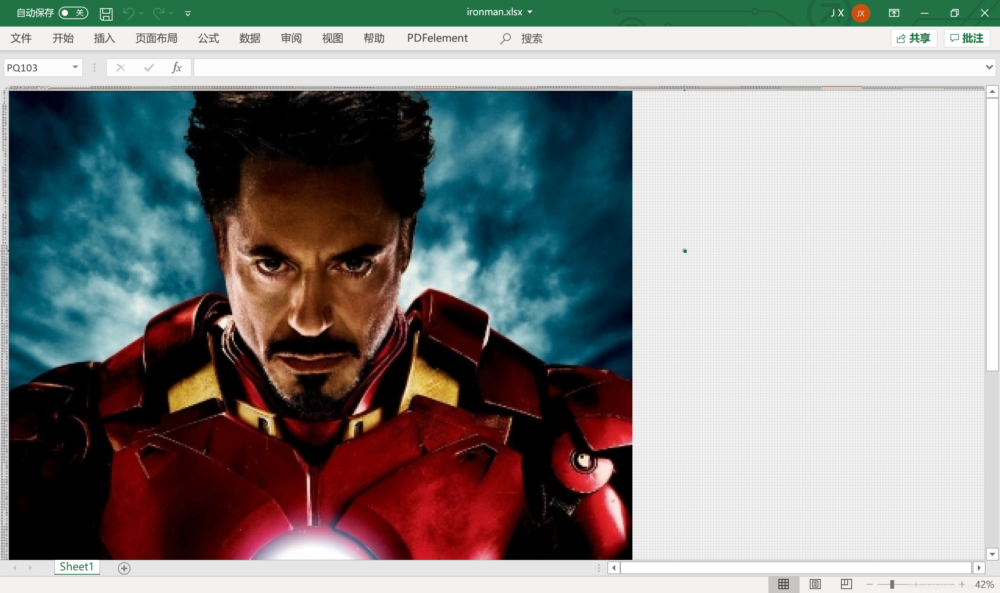
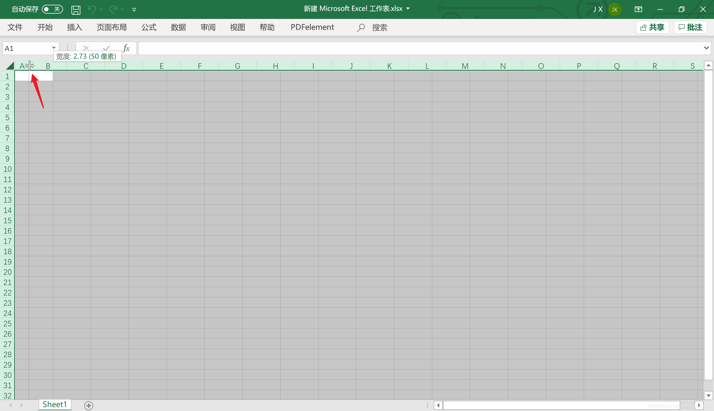
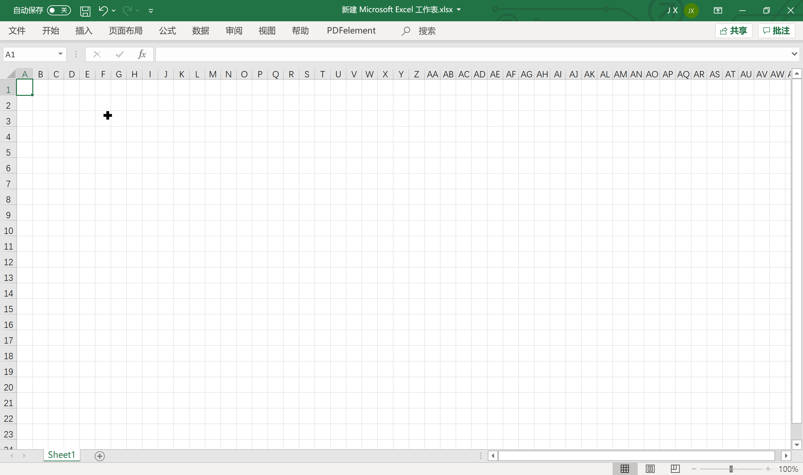

# excel_painter

最近看B站视频，有大佬徒手用excel一个格子一个格子填充，撸出了钢铁侠的图片，十分惊艳，于是决定用python脚本实现该效果。原理也非常简单，即通过opencv获取图片每个像素的RGB值，然后对excel进行操作，给每个单元格填充相应的颜色。

## 效果图

图片大小：300×183

图片大小：600×338

图片大小：400×494

## 准备材料

- **准备一个excel文件，并将其行高列高改为相同**

  **Ctrl+a** 全选表格
  调整行列宽为相同，使得最终单元格呈正方形
  

  修改效果如下：
  

- **准备一张图片**

  建议图片像素不要太高，建议一开始先选择（100×100即总像素为10000左右的图片）实验
  图片大小可以直接通过windows自带的**照片查看器**修改

## 脚本配置

- **安装需要的库**

  `pip install opencv-python`

  `pip install pypiwin32`

- **路径修改**

  准备的图片：`img_file = "D:/painter.jpg"`

  准备的表格：`WinBook = excel.Workbooks.Open('D:/painter.xlsx')`

## 过程中可能遇到的问题（必看）

- **绘制过慢问题**
  因为是两层嵌套for循环，所以会很慢，建议图片大小先事先进行修改，粗略估算总像素为10000时（100×100），遍历大概需要1分钟，500×500需要半个小时，小伙伴们可以根据自己的需求设置图片大小

- **报错：不同的单元格格式太多**
  这主要是由于图片的颜色过于丰富，且像素过多导致的。
  Excel存储的单元格样式数量的上限为(Excel 2003上限是`4000`个，Excel2007以后是`64000`个)，而每在单元格填充一个不同的颜色就会算作一个样式，所以理论上图片总像素的颜色种类不能超过64000个
  当遇到这种问题时，将图片大小调小即可解决问题（虽然牺牲了像素）
  所以制作时，在不出现明显马赛克的情况下，**尽量不要让图片太大**

